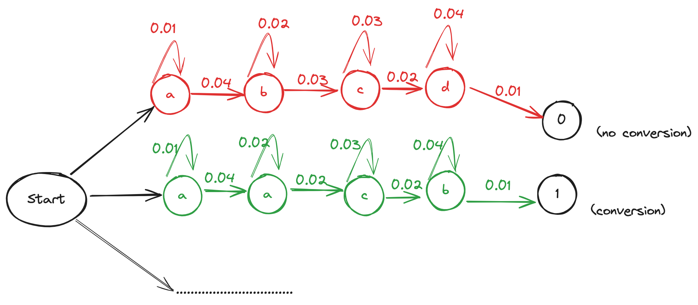
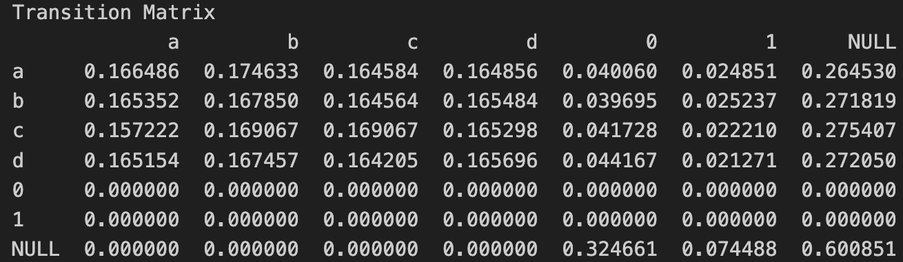

# Marketing Attribution
We have 4 different display advertising campaigns. We would like to evaluate how effective each advertising campaign is in generating sales

# Problem Definition
We have (anonymized) data which contains 10000 users who clicked on at least one of the display ads from 4 different campaigns a, b, c, or d. Purchase is indicated by the "Conversion" variable (i.e., equals 1 if there is purchase and 0 otherwise). The `Value` column indicates the revenue in dollars earned from each purchase. The cost per click for each campaign:
* a: 7
* b: 5
* c: 4
* d: 2

The order of clicks is as indicated in the data. Data example:

<table border="1" class="dataframe">
  <thead>
    <tr style="text-align: left;">
      <th>user_id</th>
      <th>click_1</th>
      <th>click_2</th>
      <th>click_3</th>
      <th>click_4</th>
      <th>click_5</th>
      <th>Conversion</th>
      <th>Value</th>
    </tr>
  </thead>
  <tbody>
    <tr>
      <th>001</th>
      <td>a</td>
      <td>b</td>
      <td>NaN</td>
      <td>d</td>
      <td>NaN</td>
      <td>0</td>
      <td>0</td>
    </tr>
    <tr>
      <th>002</th>
      <td>c</td>
      <td>c</td>
      <td>a</td>
      <td>b</td>
      <td>a</td>
      <td>1</td>
      <td>100</td>
    </tr>
  </tbody>
</table>

We would like to build a statistical attribution model to know:
* Which campaign is the most successful in terms of unit sales contributed?
* What is the return on investment for each campaign?
* How would you optimize the spend of a given budget of $1 million across all four campaigns?

# Markov Chain

We model the user's click sequence as a Markov Chain, where each state represents a campaign or a conversion state. 
The Markov Chain captures the transition probabilities between different states, allowing us to analyze the user's journey from initial ad clicks to potential conversion.

(Source: setosa.io)

### Building States
We define the following states in our Markov Chain:
* Campaign states: `a`, `b`, `c`, `d`
* Null state: `Null` (representing no click)
* Conversion states: 0 (no conversion), 1 (conversion)

Based on frequency, we can calculate the transition probabilities (when a state changes from one to another, or when a state remains). An example can be illustrated below:

The training state based on frequency can give us transition matrix

# Removal Effects
To determine the contribution of each campaign to the conversions and revenue, we calculate the removal effect of each campaign. The removal effect measures the impact of removing a campaign from the Markov Chain on the overall conversion probability.
For each campaign, we remove it from the Markov Chain by setting the transition probabilities from the removed campaign to other states and from other states to the removed campaign to 0. We then calculate the conversion probability without the removed campaign and compare it to the original conversion probability. The difference between the two probabilities gives us the removal effect of that campaign.

Let $P$ be the transition probability matrix of the Markov Chain, and $P_{\text{removed}}^{(i)}$ be the modified transition probability matrix with campaign $i$ removed.
The conversion probability with all campaigns is given by:
$$P(\text{conversion}) = P(X_t = 1 | X_0 = \text{start})$$
The conversion probability without campaign $i$ is given by:
$$P(\text{conversion}{\text{ removed}}^{(i)}) = P(X_t = 1 | X_0 = \text{start}, P{\text{removed}}^{(i)})$$
The removal effect of campaign $i$ is calculated as:
$$\text{Removal Effect}(i) = P(\text{conversion}) - P(\text{conversion}_{\text{removed}}^{(i)})$$
where:

* $X_t$: the state of the Markov Chain at time step $t$
* $X_0$: the initial state of the Markov Chain
* $P(X_t = 1 | X_0 = \text{start})$: Probability of reaching the conversion state (state 1) starting from the initial state
* $P(X_t = 1 | X_0 = \text{start}, P_{\text{removed}}^{(i)})$: probability of reaching the conversion state starting from the initial state, with campaign $i$ removed from the Markov Chain

The removal effects of each campaign: 

* `a`: -0.137 (Removing campaign `a` would decrease the conversion probability by 13.7%)
* `b`: -0.135 (Removing campaign `b` would decrease the conversion probability by 13.5%)
* `c`: -0.143 (Removing campaign `c` would decrease the conversion probability by 14.3%)
* `d`: -0.144 (Removing campaign `d` would decrease the conversion probability by 14.4%)

# Revenue Attribution
Based on removal effects, we attribute the total conversions and revenue to each campaign. The attribution is proportional to the removal effect of each campaign. We calculate the attributed conversions and revenue for each campaign based on their relative contribution to the total removal effect.

Let $\text{RE}(i)$ be the removal effect of campaign $i$, $\text{Total Conversions}$ be the total number of conversions, and $\text{Total Revenue}$ be the total revenue.
The attributed conversions for campaign $i$ is given by:
$$\text{Attributed Conversions}(i) = \frac{\text{RE}(i)}{\sum_{j=1} \text{RE}(j)} \times \text{Total Conversions}$$
The attributed revenue for campaign $i$ is given by:
$$\text{Attributed Revenue}(i) = \frac{\text{RE}(i)}{\sum_{j=1} \text{RE}(j)} \times \text{Total Revenue}$$
where:

* $\text{RE}(i)$: removal effect of campaign $i$
* $\sum_{j=1} \text{RE}(j)$: sum of removal effects of all campaigns
* $\frac{\text{RE}(i)}{\sum_{j=1} \text{RE}(j)}$: proportion of the removal effect of campaign $i$ relative to the total removal effect of all campaigns
* $\text{Total Conversions}$: total conversions across all campaigns
* $\text{Total Revenue}$: total revenue generated across all campaigns

The revenue attribution of each campaign: 

* `a`: 21567 (~24%)
* `b`: 21210 (~24%)
* `c`: 22463 (~26%)
* `d`: 22691 (~26%)

With total cost of each campaign ($ = \text{cost per click} \times \text{total number click}$), we can calculate return on investment (%) for each campaign:
* `a`: -58%
* `b`: -44%
* `c`: -24%
* `d`: 54%

as can be seen, only campaign `d` makes a profit. This is because campaign `d` has the cheapest cost per click (CPC), while each campaign almost got the same number of total click (~7.5k). Nevertheless, this doesn't mean we only invest campaign `d` and opt out of the others. As stated above, if we removed any single campaign, the conversion probabiliy would be decreased by 14%

# Budget Optimization
To optimize the budget allocation across the campaigns, we formulate an optimization problem using linear programming. The objective is to maximize the total attributed revenue while satisfying the budget constraints.

Assuming retun on investment of each campaign is constant, the optimization problem is set up as follows:

Decision variables: $\mathbf{x} = [x_a, x_b, x_c, x_d]^T$ (representing the budget allocation for each campaign)
Objective function: Maximize the total attributed revenue
Constraints:

* Total budget constraint: $x_a + x_b + x_c + x_d$ = total budget
* Non-negativity constraints: all $x_a$, $x_b$, $x_c$, $x_d$ > 0
* Removal effect constraints: Ensure that the attributed revenue for each campaign is consistent with the removal effects

Let:
* $\mathbf{x} = [x_a, x_b, x_c, x_d]^T$ be the vector of decision variables representing the budget allocation for each campaign
* $\mathbf{r} = [r_a, r_b, r_c, r_d]^T$ be the vector of attributed revenue per unit budget for each campaign where $\mathbf{r} = (1 + \text{return on investment (\%)}) \times \text{cost}$
* $\mathbf{RE} = [\text{RE}_a, \text{RE}_b, \text{RE}_c, \text{RE}_d]^T$ be the vector of removal effects for each campaign
* $\mathbf{AR} = [\text{AR}_a, \text{AR}_b, \text{AR}_c, \text{AR}_d]^T$ be the vector of attributed revenue for each campaign.

The optimization problem can be formulated as follows:
* Objective function: $$\text{Maximize: } \mathbf{r}^T \mathbf{x}$$

Subject to:

* Total budget constraint: $$\mathbf{1}^T \mathbf{x} = \text{total budget}$$
* Removal effect constraints: $$\mathbf{AR} = \frac{\mathbf{RE}}{\mathbf{1}^T \mathbf{RE}} \odot (\mathbf{r}^T \mathbf{x})$$

The optimization problem can be solved using linear programming techniques, to obtain the optimal budget allocation $\mathbf{x}$ that maximizes the total attributed revenue while satisfying the constraints. 

The outcome gave us the allocated budget to each campaign:
* `a`: 384497 (38%)
* `b`: 283741 (28%)
* `c`: 221652 (22%)
* `d`: 110110 (11%)

# Limitation

* High Variance: Markov chain model relies on frequency-based probabilities. It requires a large amount of data to accurately estimate the transition probabilities between states. If the data is limited or too many noises, the model's accuracy could be skrewed. New or rare occurrences can significantly impact the probabilities, making the model sensitive to outliers or changes in user behavior.
* Memoryless: This linear Markov chains assume that the future state depends only on the current state, not on the sequence of events that preceded it. In the context of marketing attribution, the user's previous interactions and the sequence of touchpoints may have a significant impact on their decision to convert. The Markov chain model does not capture this long-term dependency explicitly. User journeys and states may be more complex, with multiple touchpoints, non-linear paths with external factors.
* Stationarity: Markov chains often assume that the transition probabilities remain constant over time (stationarity assumption). In practice, user behavior and preferences may evolve, and the effectiveness of marketing campaigns may change over time.
* Independence: Removal effect of a campaign assume the independence on the overall conversion probability, i.e. the removal of a campaign does not affect the effectiveness of other campaigns. It may not capture the synergistic effects or interactions between campaigns. 

